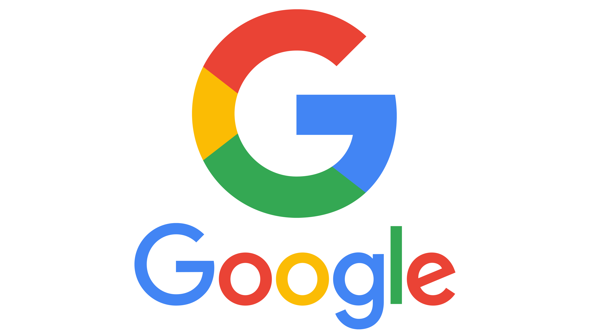
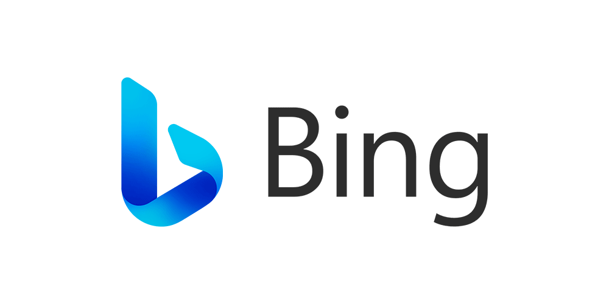
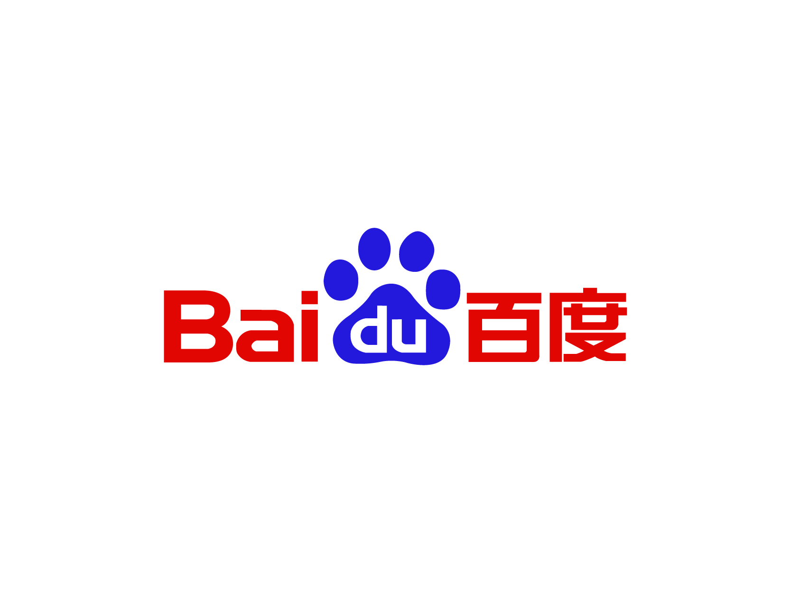
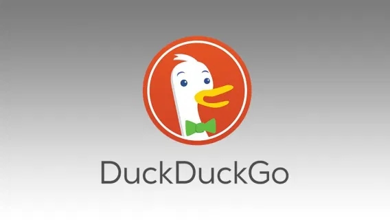

在本文中，煮包将解释什么是搜索引擎、常见的搜索引擎简介以及一些使用小技巧。

# 什么是搜索引擎

延续我们上一篇[《介绍常见的浏览器.md》](介绍常见的浏览器.md)的类比逻辑：将互联网比作一个没有边界的超级图书馆，在浏览器的帮助下，你已经可以读懂每本图书在讲什么。但是问题还有一个还没有解决：当你进入这个图书馆，你根本不知道从哪里开始：书架编号（即域名）已经多到无法统计了，图书编号（即URL 参数）更是在书架编号上翻了好几倍。如果你需要查询一个问题，在没有搜索引擎的帮助下，你可能穷尽一生都找不到答案。搜索引擎就是为了解决这一痛点而产生的。

简单来讲，搜索引擎就是这个图书馆的"万事通先生"。搜索引擎在图书馆的每个角落都放了一些小机器人（即爬虫），这些小机器人会将他们在这个网页看到的信息进行整理，告诉搜索引擎这些网站的关键字/词/句。当你来问搜索引擎时，搜索引擎就会将你的问题拆分成一些关键字/词/句，然后再和之前整理好的关键字/词/句匹配，最后告诉你可以在哪些网站满足你的需求。

# 市面上常见的搜索引擎

介绍完了搜索引擎的基本概念，接下来我们来仔细盘一盘市面上常见的搜索引擎。

## Google（谷歌）——搜索引擎界最严厉的父亲

Google 是全球最常用的搜索引擎，市场占有率常年维持在 90% 以上。Google 的排名算法非常严格，只把最相关、最权威的页面放在前面。如果你想搜英文技术资料或学术内容，Google 通常是第一选择。

> [!info] 举个例子
> 近年来由于AI大模型文本生成能力不断提升，有一部分人就会使用AI生成部分没有技术含量和参考价值的文本，以此用来植入广告。再通过一些特殊的手段提高文章的阅读量。如果是其他搜索引擎的话，只能依靠大量用户手动一个一个举报和屏蔽，而谷歌会有专人审查这些内容，以更快的从搜索结果中移除

 谷歌的周边生态十分丰富，比如国外同学熟悉的 Google 学术（Google Scholar）、Google 图片、Google 地图、YouTube 搜索等，借助谷歌自家的大模型 Gemini ,谷歌最先发明的的 AI 辅助搜索（Google Overview）能直接生成答案摘要。

不过嘛，就像上篇文章说的一样，谷歌早在2010年就退出了中国市场，所以如果你想要使用谷歌的搜索引擎服务，你需要提前准备“科学上网”环境。

## Bing（必应）——谷歌的国内平替

Bing 是微软旗下的搜索引擎，在中国大陆可以直接访问，是个不错的选择。虽然体验上远不及谷歌，但在国内网络环境下，必应已经是目前国内质量较好，体验较优以及相对大众的搜索引擎了。

必应基本集成了谷歌搜索该有的功能，如图片搜索、视频搜索等。如果你还会“科学上网”的话，你还可以体验到必应上的搜索助手 Copilot，你可以用它来得到更准确、更全面的答案。

不会“科学上网”也没有关系，必应在国内还有一个 Bing Rewards 积分。简单来说，通过使用必应、搜索指定关键词以及一些其他任务，微软就会给你一些 Rewards 积分。Rewards 积分可以用来兑换各种购物卡券，比如肯德基、滴滴等等。

## 百度——没落的搜索引擎贵族

百度是中国最大的搜索引擎，中文内容的覆盖最为全面。如果你要搜索国内的生活信息、政策文件、学校资讯，百度是效率最高的选择。同时，百度旗下的百度百科、百度地图、百度贴吧、百度文库等生态产品已经深入我们生活的方方面面。

不过话说回来，近几年来百度搜索结果中广告几乎占据了第一页的所有内容，尤其是商业关键词（比如搜索"医院"、"留学"），电脑小白要学会分辨哪些是广告、哪些是自然结果。这导致这几年百度搜索引擎的市场占有率持续下滑。再加上没有乘上 AI 的东风，说他是“没落的搜索引擎贵族”一点也不为过。

> [!info] 如何区分百度的自然搜索结果与广告插入
> - 一般来讲，百度在一条结果最下方标注了"广告"字样的都是广告的付费推广。
> - 认准官方网站。百度会在部分结果下标注“官网”字样，但是不是每一个都准确，需要你准确辨别。比如下载微信要检查每条结果有没有带“腾讯”或“Tencent”字样；下载Win 11安装镜像要检查每条结果有没有带“微软”或“Microsoft”字样。
> - 如果有必要，你可以打开你浏览器的插件市场，找到“AdGuard”或“uBlock Origin”来屏蔽广告。

## DuckDuckGo——保护隐私的小众选择

DuckDuckGo 的卖点很明确：**不追踪你，不记录你，不针对你**。它不会根据你的搜索历史来个性化结果，也不会收集你的个人信息卖给广告商。这就有一个优点：DuckDuckGo 的搜索结果不存在"信息茧房"效应，同一个关键词谁搜结果都一样。同时，DuckDuckGo 支持 !bang 快捷语法——比如在 DuckDuckGo 搜 `!w 搜索引擎` 直接跳到维基百科，搜 `!g 天气预报` 直接用 Google 搜，非常方便。

美中不足的一点是，由于国内使用人数不多，DuckDuckGo 中文搜索结果的质量一般，更适合英文搜索或在注重隐私的场景下使用。

## Yandex——俄罗斯的搜索主力

Yandex 是俄罗斯最大的互联网公司，其搜索引擎在俄语国家和东欧地区占据主导地位。除了搜索之外，Yandex 还有自己的浏览器、地图、邮件等服务，可以说是"俄罗斯的 Google"。如果你需要搜索俄语内容、东欧地区的资料或俄罗斯网站的信息，Yandex 是最佳选择。

## 其他搜索引擎

除了以上几款，还有一些值得一提的：

- **Sogou（搜狗搜索）、360搜索**：不推荐，这两个搜索引擎的广告只会比百度更多。
- **Brave Search**：注重隐私的独立搜索引擎，不依赖 Google 或 Bing 的索引。

# 搜索引擎实用小技巧

**基础语法（大多数搜索引擎通用）：**
- `"精确短语"`——搜完全匹配的内容，比如 `"如何用Python写爬虫"`
- `-排除词`——排除不想要的结果，比如 `苹果 -水果`（排除水果相关的结果）
- `site:域名`——限定在某个网站内搜，比如 `site:github.com openclaw`
- `filetype:格式`——搜索特定文件类型，比如 `论文 filetype:pdf`
- `intitle:关键词`——只在网页标题里搜索

**实战建议：**
1. **搜技术问题首选英文**：绝大多数编程问答都在 Stack Overflow 和 GitHub 上，英文搜索结果质量远高于中文
2. **关键词越具体越好**：搜"想买个手机打游戏"不如搜"2025年 3000元 游戏手机 推荐"
3. **试试 AI 搜索**：Bing Copilot、Google Gemini、Perplexity 这些 AI 搜索工具能直接帮你总结答案，省去一页页翻链接的时间
