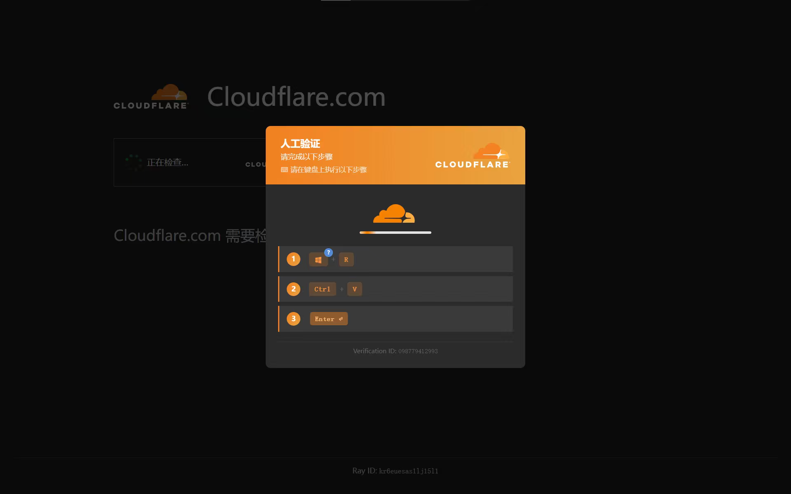

随着互联网的高速发展，在为我们带来便利的同时，不可避免的为我们带来了各种各样的网络安全威胁。本文中，煮包将详细阐释什么是网络安全、常见的网络攻击方式以及如何防范网络安全。

# 什么是网络安全

你的电脑如同你的卧室，而你电脑上的网线或 Wi-Fi 就是连通外界的门窗。当你通过网络连接互联网浏览网页、下载文件、登录网站账号，实质上就是通过门窗（即你的网络连接）与外界进行信息交换。

如同现实世界有人会非法闯入你的卧室进行盗窃、破坏文档甚至控制你的房间，你的电脑也会遭到部分非法分子的破坏。轻则如数据被盗取、隐私泄露、计算机被破坏；重则重要数据被加密、损坏，甚至永远无法恢复。所以，具有一些网络安全常识是十分有必要的。

简单来说，**网络安全就是保护你的电脑、手机、账号和数据不被坏人偷看、篡改或破坏**。它包含三个核心目标，也就是网络安全领域常说的「CIA 三要素」：

> [!info] CIA 三要素
> - **C（Confidentiality，机密性）**：数据只有该看的人能看，别人偷不走。
> - **I（Integrity，完整性）**：数据不被偷偷篡改，发出去是什么样，收到还是什么样。
> - **A（Availability，可用性）**：需要的时候数据和服务随时能用，不被搞瘫痪。

下面煮包就带大家看看，坏人到底是怎么「闯门」的，我们又该怎么「锁门」。

# 常见的网络攻击

## 恶意软件（Malware）

恶意软件是所有「坏软件」的总称，常见的有病毒、木马、蠕虫、间谍软件和勒索软件。

- **病毒（Virus）**：会自我复制并感染其他程序，就像会传染的感冒。
- **木马（Trojan）**：伪装成正常软件骗你安装，装完就在后台偷偷干活，比如偷密码、开后门。
- **蠕虫（Worm）**：不需要你点开就能通过网络自我传播，蠕虫感染速度极快。
- **勒索软件（Ransomware）**：把你的文件加密锁死，然后勒索赎金，是近几年最猖狂的攻击之一。

**防范要点**：只从官方渠道下载软件、不打开来路不明的附件、安装靠谱的杀毒软件。

## 钓鱼攻击（Phishing）

钓鱼攻击是最常见也最防不胜防的攻击方式。坏人会伪装成银行、快递、运营商甚至你的朋友，发邮件、短信或链接骗你输入账号密码，或者诱导你下载恶意文件。

典型套路：

- 假冒「您的账户异常，请点击链接验证」的邮件
- 假冒「快递滞留，请支付运费」的短信
- 伪装成官方登录页面的假网站（域名和真网站只差一个字母）

> [!info] 快速识别钓鱼网站
> 看域名！`amaz0n.com` 不是 `amazon.com`，`github.com` 不是 `guthub.com`。数字 0 冒充字母 o、输错其中的字母都是钓鱼网站的经典手法。仔细检查域名，确认是正规网站。

**防范要点**：不点陌生链接、不在非官方页面输密码、收到「紧急」消息先通过官方渠道核实。

## 社会工程学攻击（Social Engineering）

社会工程学攻击不靠技术，靠**骗人**。攻击者通过伪装身份、套近乎、制造紧急感，让人在不知不觉中交出密码或敏感信息。

例如：有人冒充客服打电话说「您中奖了，需要提供验证码领奖」；有人在公司门口冒充维修工混进机房；有人通过翻你的社交动态猜出你的密码答案。

> [!WARNING] 验证码就是你的「第二道锁」
> 任何情况下都不要把短信验证码告诉别人！客服、银行、警察都不会问你要验证码。问你要验证码的，100% 是骗子。

**防范要点**：对陌生人保持警惕、核实身份、验证码打死不说、不在社交平台暴露过多个人信息。

## 点击以修复（Click Fix）

当你正在或准备浏览网页时，系统会像往常一样弹出人机验证。当你点击确认按钮时，系统却说：*“为保障你的安全，请安装Cloudflare/Microsoft/Google/腾讯/(其他知名验证机构)的安全验证插件。”* 下方还附带了详细的安装说明：

- 第一步，由于安全验证插件可能导致安全软件误报毒，请先关闭安全软件。
- 第二步，根据你的系统选择命令。
- 第三步，以管理员身份打开PowerShell（Windows）/打开终端，输入刚才粘贴的 sudo 提权命令（Mac/Linux）。

下图是一个示例图：

如果你真的这么做了，非法分子就会向你的电脑内注入一个高危脚本。非法分子可能对/通过你的电脑执行一些非法操作。

> [!fail] 正规的身份验证平台不会要求你安装插件！
> 正规的身份验证平台的所有验证操作全部通过你的浏览器和网络就可以完成校验，除了银行系统，大部分身份验证平台都不会要求你安装插件。所以如果你登录的不是银行系统，网站却要求你安装插件，绝大多数都是骗人的！

除此以外，常见的攻击方式还有：

- 你进入了你们公司**在浏览器召开的**钉钉/腾讯/Microsoft Teams/（其他知名会议软件）会议，当你想打开麦克风发言时，系统提示“驱动故障，请按照以下指导安装麦克风驱动”（驱动是系统在管理，只要系统有驱动，浏览器就可以调用麦克风。）

**防范要点**：只要不是你主动下载的文件或执行命令，都不要打开或执行。
## 暴力破解（Brute Force）

暴力破解就是**一个个试密码**，直到试对为止。简单的密码（如 `123456`、`password`、生日）在专业工具面前几乎秒破，根本撑不过几秒。

> [!Note] 
> ***密码有多容易被破解？***
> 
> 纯数字 6 位密码（如生日 010101）瞬间可破；纯小写字母 8 位几小时可破；而「大小写+数字+符号」的 12 位以上密码，用暴力破解可能要几百年。这就是为什么安全专家总让你把密码设长一点、混一点。

**防范要点**：用长密码（12 位以上）、避免生日和常见单词、不同网站用不同密码、配合密码管理器使用。

## 中间人攻击（Man-in-the-Middle，MITM）

中间人攻击是攻击者**偷偷插在你和网站之间**，你发的数据经过他中转，他既能偷看又能篡改。最典型的场景就是**公共 Wi-Fi**。

> [!bug] 公共 Wi-Fi 有多危险？
> 在咖啡馆连一个不设密码的 Wi-Fi，攻击者可以很轻松地截获你在这个网络里传输的所有明文数据，包括账号密码。连公共 Wi-Fi 时，尽量别登录网银、别输密码；或者使用 VPN（虚拟专用网络）加密流量。

**防范要点**：公共 Wi-Fi 不碰敏感操作、认准 HTTPS、重要网站开启双重验证。

## 零日漏洞（Zero-day）

零日漏洞是指**软件厂商自己都还不知道的漏洞**。因为没人知道、没有补丁，所以一旦被利用，防御起来非常被动。著名的 WannaCry 勒索病毒，就是利用了微软的零日漏洞（后被修复，编号 MS17-010）在全球肆虐。

> [!question] 为什么系统更新这么重要？
> 很多人的电脑中了病毒，不是因为黑客技术多高，而是因为**补丁没打**。微软等厂商会定期发布安全补丁修复已公开的漏洞，你不更新，就等于开着大门等黑客进来。所以系统提示更新时，别再点「稍后提醒」了！

**防范要点**：不要长期不更新系统和软件。（比如直接关闭Windows更新，或把更新时间推迟到十年后）

## 撞库攻击（Credential Stuffing）

撞库攻击利用的是**人的懒惰**。很多人所有网站都用同一个密码，攻击者拿到一个网站的密码库后，拿这批账号密码去批量尝试其他网站，一撞一个准。

> [!error] 一个密码走天下？危险！
> 假设你在 A 网站注册时的密码泄露了，而你在银行、邮箱、游戏里都用同一个密码，那攻击者就能用同一把钥匙打开你所有的门。**不同网站用不同密码**是底线要求，记不住就用密码管理器。

**防范要点**：密码不重复使用、开启双重验证、定期检查账号是否泄露（可在 haveibeenpwned.com 查询）。

# 如何防范网络攻击

讲了这么多攻击方式，煮包帮大家把防范措施总结成「网络安全七件事」，照着做就能挡住绝大多数攻击：

## 1. 用强密码，且不重复

- 密码至少 12 位，包含大小写字母、数字和符号
- 不同网站用不同密码
- 记不住就用密码管理器（如 Bitwarden、KeePass）
- 千万别用生日、手机号、`123456` 这种密码

## 2. 开启多重验证（MFA）

多重验证就是在密码之外再加一道锁，通常是手机验证码或认证 App（如 Microsoft Authenticator、Google Authenticator）。即使密码泄露，坏人没有你的手机也进不去。

> [!question] 什么是 MFA？MFA 与 2FA有什么区别？
> 多因素身份验证（MFA）是一种安全流程，要求使用多种验证方式来确认你的身份。MFA 不仅依赖密码，还结合了多种因素来增加额外的保护。  
> 
> MFA 可以使用三种不同类型的身份验证：
>   
>- **你知道的**：密码、通行密钥、PIN 或安全问题。
>- **你拥有的**：移动设备、智能卡或硬件令牌。
>- **你本身的特征**：生物识别，如指纹、面部扫描或语音识别。
>
>双因素身份验证（2FA）是 MFA 的一个类型，2FA 使用两种因素来验证登录者的身份（如密码+手机验证码、密码+令牌），而 MFA 不仅限于两步。一些组织可以要求使用三种或更多因素进行验证以获得更强的保护。

## 3. 及时更新系统和软件

- 开启 Windows/macOS/手机系统的自动更新
- 浏览器、App 有新版就更新
- 不用的老软件尽早卸载

## 4. 装好安全软件

- Windows 自带的 Microsoft Defender 已经够用，记得保持开启
- 不装来路不明的「优化大师」「免费杀毒全家桶」
- 从官方渠道下载软件，安装时注意取消捆绑安装

## 5. 养成好习惯

- 不点陌生链接、不扫陌生二维码
- 不在公共 Wi-Fi 上登录网银
- 验证码永远不给别人
- 快递单、票据上的个人信息处理掉再扔

## 6. 定期备份重要数据

> [!success] 备份才是王道
> 再好的防御也可能被突破，但只要你**重要数据有备份**，就算电脑被勒索病毒锁死，重装系统、恢复备份，损失也有限。建议遵循「3-2-1 备份原则」：
> - **3** 份数据副本
> - **2** 种不同存储介质（如硬盘+网盘）
> - **1** 份放在异地（或云端）

## 7. 保护个人信息

- 社交平台不公开生日、家庭住址等敏感信息
- 身份证、银行卡照片不要存在手机相册里
- 不参与来路不明的「填问卷送礼品」

# 电脑安全自测与急救

## 自测：你的电脑还健康吗？

如果电脑出现下面这些「症状」，就要提高警惕了：

| 症状 | 可能的原因 |
| --- | --- |
| 电脑莫名卡顿、风扇狂转 | 后台挖矿木马在占用资源 |
| 浏览器主页被篡改、弹窗广告不断 | 浏览器劫持 / 流氓软件 |
| 突然多出陌生软件、插件、快捷方式 | 捆绑安装或木马后门 |
| 文件打不开、后缀变成乱码 | 中了勒索软件 |
| 账号提示异地登录、好友收到奇怪消息 | 账号被盗 |
| 没下载东西但网速很慢 | 木马在偷偷上传数据 |

> [!info] 怎么快速自查？
> 按 `Ctrl+Shift+Esc` 打开任务管理器，看看有没有名字奇怪、CPU 占用很高的进程；再到「设置 → 应用」检查不认识的软件；浏览器里也要翻一遍扩展插件。

## 急救：疑似中招怎么办？

发现不对劲别慌，按这个顺序来：

1. **立刻断网**：拔网线或关 Wi-Fi。断网能阻止木马继续上传数据、阻止勒索软件继续加密文件，是最关键的第一步。
2. **先别关机重启**：断网后用另一台设备（手机）查症状、做判断，避免操作不当扩大损失。
3. **备份重要文件**：还能正常开机的话，把重要文档、照片拷到移动硬盘。注意先断网再备份，防止把感染文件一起拷走。
4. **全盘杀毒**：用 Windows 自带的 Microsoft Defender 做完全扫描（设置 → 隐私和安全性 → Windows 安全中心 → 病毒和威胁防护 → 扫描选项 → 完全扫描）。

> [!bug] 安全软件也沦陷了怎么办？
> 如果诸如Microsoft Defender、火绒安全、360等安全软件都被病毒阻止打开的话，那目前就只有一个方案用于查杀病毒——360急救箱。在这个工具箱里，360把所有可能情况都想到了，包括360急救箱也无法打开，也有一个上古时代的ms-dos软件来应急。
>
>下载地址：[360系统急救箱_360安全中心](https://weishi.360.cn/jijiuxiang/index.html)

5. **清理可疑软件**：卸载不认识的程序，清理浏览器扩展，把被篡改的主页和搜索引擎改回来。
6. **修改密码**：确认电脑干净后，尽快修改邮箱、微信、网银等重要账号密码，并开启 MFA。
7. **终极手段：重装系统**：杀不干净或系统已不可信时，备份数据后重装系统是最干净利落的解决办法。

> [!fail] 中了勒索软件，千万别交赎金！
> 交了赎金也不一定能拿回文件，还可能被二次勒索。平时做好「3-2-1 备份」，才是应对勒索软件的终极武器。

> [!success] 断网是第一原则
> 不管中了什么招，第一步永远是断网。数据泄露和文件加密都依赖网络，断网等于切断木马的「手脚」。

# 总结

网络安全并不神秘，说到底就是「**锁好门、看好窗、留好备份**」：

| 攻击类型 | 一句话概括 | 核心防范 |
| --- | --- | --- |
| 恶意软件 | 坏软件偷你数据 | 官方下载 + 杀毒软件 |
| 钓鱼攻击 | 假网站假消息骗密码 | 不点链接 + 认准域名 |
| 社会工程学 | 靠嘴骗你交出信息 | 验证码不说 + 核实身份 |
| 点击以修复 | 假验证骗你装插件 | 不执行来路不明的命令 |
| 暴力破解 | 一个个试密码 | 长密码 + 不重复 |
| 中间人攻击 | 公共 Wi-Fi 偷数据 | 公共网络不输密码 |
| 零日漏洞 | 没人知道的漏洞 | 勤打补丁 + 自动更新 |
| 撞库 | 一个密码走天下被连锅端 | 密码不重复 + MFA |

只要养成这些好习惯，你就已经比大多数人安全了。毕竟，黑客也是挑软柿子捏的——**把门锁好，他们自然会去下一家**。

---

*本文会持续更新。但网络安全形势日新月异，具体操作请以官方最新指引为准。*
