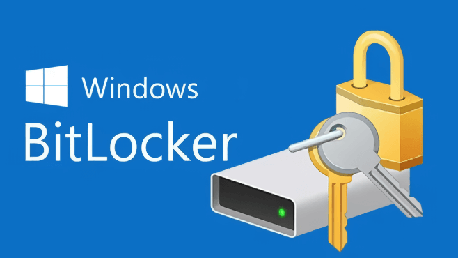
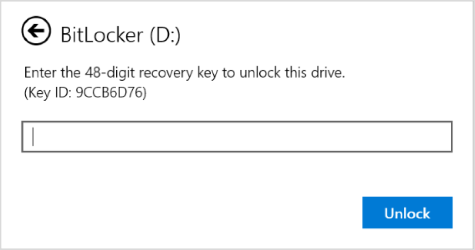
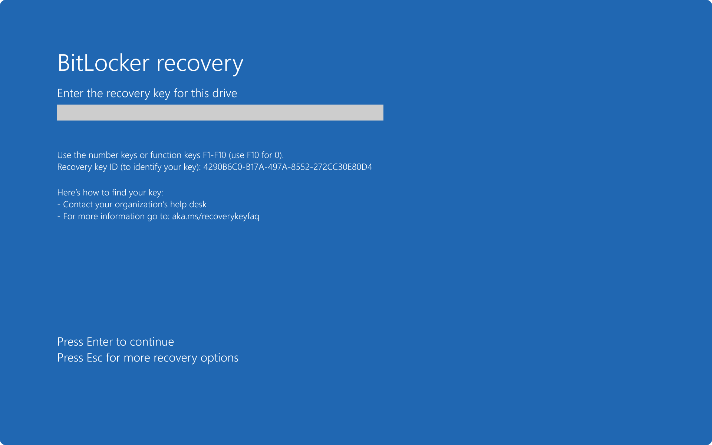
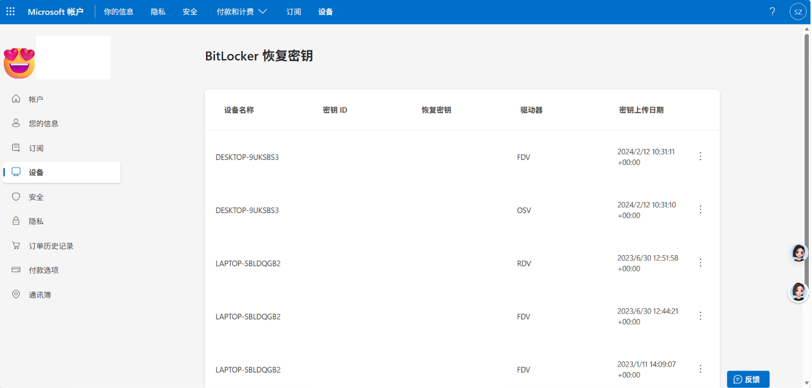
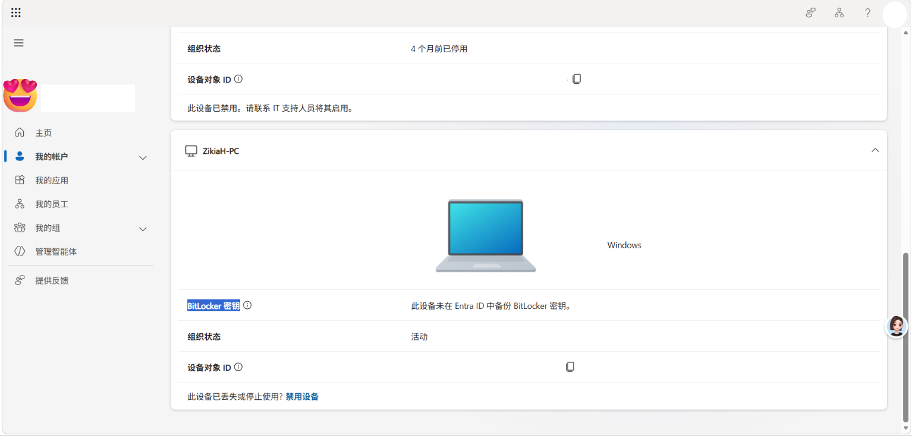
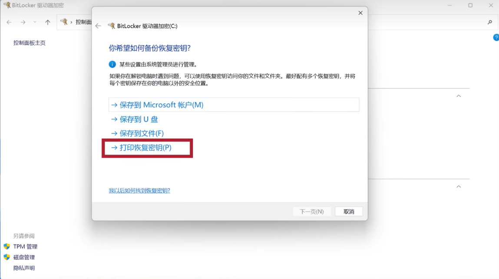
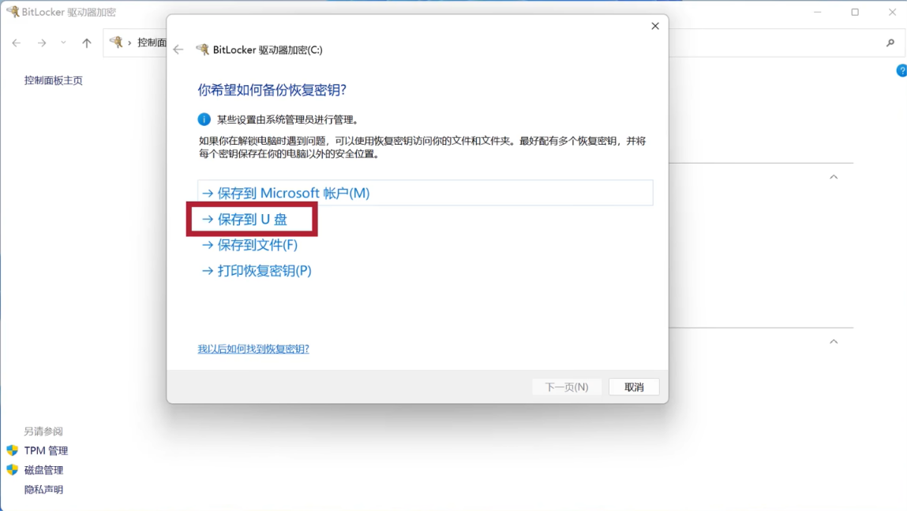
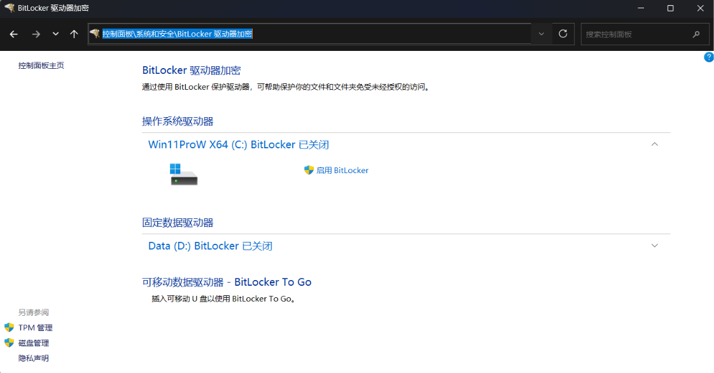

网络上有很多关于 BitLocker 血与泪的真实案例，一般这些案例描述如下：

> [!NOTE] 常见 BitLocker 真实案例
> - 我只是把我的硬盘拆下来装到了另一台电脑上，就出现了这个界面让我输入什么密钥😨
> - 我只是把我的电脑送给维修机构修理了，结果电脑打不开了😭
> - 我想让师傅帮我备份一下我电脑上的文件，师傅却说你知道你的 BitLocker 密钥吗，我怎么不知道我的电脑上了锁啊😢
> 
> 最后，无一例外，这些人都放弃了电脑上的数据，选择重装系统。

下方是一些小红书上的例子：

那么，什么是 BitLocker 呢？本文将介绍 BitLocker 是什么、出现恢复界面该怎么办以及如何开启和关闭 BitLocker 。

# 什么是 BitLocker ?

BitLocker 自 Windows Vista 起作为系统功能出现在历代 Windows 版本中，旨在为整个卷提供加密，以解决丢失、被盗或不当停用设备导致的数据被盗或暴露的威胁。

众所周知， Windows 以开放著称。所以，这对个人用户来说，个人用户可以自定义系统的每一处地方。但对企业用户和一些及其看重隐私用户来说，开放反而是一个大问题。所以， Windows 自 Windows Vista 起引入了磁盘加密机制，旨在保护非法的数据访问。

> [!info] 提示
>  自 Windows 8 起，只要你的设备支持设备加密，这个功能就会在机器出场时默认开启，在你在开箱激活的时候登录微软账号自动绑定。
>  
>  不过，转念一想，除了部分极其重视隐私的用户，普通用户哪来的那么多需要加密的内容呢？这反而会造成一些不必要麻烦

 BitLocker 一般会在以下情形下启用恢复界面，以验证是否是你本人在访问这块硬盘：
 
- 你更新了你的主板硬件或直接更换了主板。
- 你更换了主板的 TPM 芯片。
- 你修改了主板 BIOS 的设置。
- 你正在使用非正式环境访问硬盘。（如 WinRE 环境、 WinPE 环境、WinToGo 环境）
- 你多次输错了开机 PIN 码，达到了锁定阈值。

通常来讲，恢复界面应该长这样：

1. 要求解锁外置存储的 BitLocker 👇

   

2. 要求解锁本地存储的 BitLocker 👇

   

我们将会在下文详细地介绍遇到这种界面该怎么办。

# 出现恢复界面该怎么办？

当你的电脑出现了上述的恢复界面，想要成功启动电脑或访问磁盘数据，唯一办法是找到屏幕上指示的恢复密钥 ID 对应的恢复密钥，否则就只能放弃所有文件重装系统。

> [!fail] 重要提示
> 输入恢复密钥是你理论上唯一能访问硬盘或启动电脑的方法，根据微软官方说法：
> 
> - ***Microsoft 无法找到 BitLocker 恢复密钥或绕过 BitLocker 恢复屏幕，因为这会损害 BitLocker 加密提供的保护。***
> - ***如果无法找到恢复密钥,则必须格式化设备并重新安装 Windows 。***

下文将介绍在哪里可以找到 BitLocker 恢复密钥。
## 查找恢复密钥的办法

### 通过微软账号

如果你在你的电脑上登录过微软账号，那么你的微软账号上极有可能存放着你电脑的恢复密钥，这里分个人账号和工作和学校账号（企业账号）讨论。

#### 在个人账号上

访问 [个人账号密钥查询界面](https://account.microsoft.com/devices/recoverykey) ，登录你自己的微软账号（如果已登录可能需要进行二次验证），在此你就能看到曾经上传到你微软账号的恢复密钥了。

> [!tip] 提示
> 如果没有看到恢复密钥也不要着急。如果这台电脑的开箱设置不是你亲自完成的，你可以联系其他帮助你设置的人（比如你的二手卖家或者你的好朋友），让他登录他的账号进行查找。

#### 在工作与学校账号上

> [!question] 提示
> 本方法仅适用于工作或学习账号。通常来讲，这些账号应该长的像下面这几种类型：
> 
> - `example@<组织域名>.com`（公司邮箱）
> - `example@<组织域名>.onmicrosoft.com`（微软 Azure 保留域邮箱）
> - `example@<组织域名>.partner.onmschina.cn`（由世纪互联运营的 Azure 保留域邮箱）
> 
> 如果你的账号不属于上述几种类型，或者你看不懂上述描述，请**跳过本节**。

访问 [企业账号密钥查询界面](https://myworkaccount.microsoft.com/device-list) ，登录你的工作和学校账号（部分组织可能会要求启用 MFA 认证）。找到这台电脑，上面的 BitLocker 密钥极有可能可以用来解锁。

> [!tip] 提示
> 由于不同组织可能会有不同的 Microsoft Entra ID 策略和 Microsoft Intune 策略，你有可能无法看到你设备的恢复密钥。
> 
> 如果你无法看到你的恢复密钥，你可以联系您司的 IT 部门，或联系有 Microsoft Entra ID 和 Microsoft Intune 管理员权限的朋友，他们或许可以帮助你找到恢复密钥。

### 通过保存的恢复密钥文件上

如果你是主动开启的 BitLocker ，且选择保存的方式是保存在打印文件上，那么恢复密钥可能就在那张打印文件上。

### 通过 U 盘

如果你是主动开启的 BitLocker ，且选择保存的方式是保存在 U 盘上，那么恢复密钥可能就在当时的 U 盘上。

把 U 盘插到出现恢复界面的电脑上试试。如果电脑有反应，就按屏幕上的提示尝试恢复；如果没有，你可能需要准备另一台设备，插入 U 盘，找到里面的恢复密钥文件。

# 如何开启或关闭 BitLocker ?

## 开启 BitLocker

> [!info] 提示
> 如果你用的是 Windows 家庭版，系统里可能只有「**设备加密**」，看不到完整的 BitLocker 管理界面。设备加密可以理解为 BitLocker 的"简版"（底层是同一套技术），开关在 **设置 → 隐私和安全性 → 设备加密**。

专业版 / 企业版开启完整 BitLocker 的步骤：

1. 打开「**控制面板**」→「**系统和安全**」→「**BitLocker 驱动器加密**」
   （也可以在开始菜单直接搜索"管理 BitLocker"）
2. 在要加密的驱动器上点「**启用 BitLocker**」
3. **选择解锁方式**：
   - 有 TPM 芯片的电脑：可以选择「使用 PIN 解锁」（以后开机需要输 PIN）
   - 也可以选择「使用密码解锁」
4. **备份恢复密钥**（最关键的一步）——系统会给出几个选项：
   - **保存到你的 Microsoft 账户**（推荐，之后可通过自己的微软账号查到）
   - 保存到 U 盘
   - 保存到文件
   - 打印恢复密钥

   > [!warning] 再次强调
   > 恢复密钥是唯一的"备用钥匙"。这一步偷懒，将来触发恢复界面时就只能重装系统了——就像文章开头那些案例一样。

5. 选择**加密范围**：新电脑、新装的系统选「仅加密已用磁盘空间」就够（快）；已经装了较多数据的老盘选「加密整个驱动器」
6. 选择**加密模式**：固定硬盘用「新加密模式」即可；如果这块盘以后可能要拆到更老的系统上使用，选「兼容模式」
7. 点「下一步」→「开始加密」。加密期间可以正常使用电脑，但**不要强制关机或断电**

## 关闭 BitLocker

从同一个入口进去，点「**关闭 BitLocker**」即可。有几点要注意：

- 关闭的过程实际上是**解密**，加密花了多久，解密差不多也要多久（大容量硬盘可能要几个小时）
- 解密过程中同样**不要断电或强制关机**
- 如果你只是"不想每次开机都输 PIN"，其实可以选择「**暂停保护**」而不是关闭：暂停后硬盘仍然是加密状态，只是暂时不做校验，比彻底解密省事得多

> [!tip] 怎么知道自己有没有开
> 打开「此电脑」，看磁盘图标：**带一把打开的锁**就说明这个盘已加密；
> 也可以在开始菜单搜索「**管理 BitLocker**」，里面会列出每个驱动器的加密状态。
