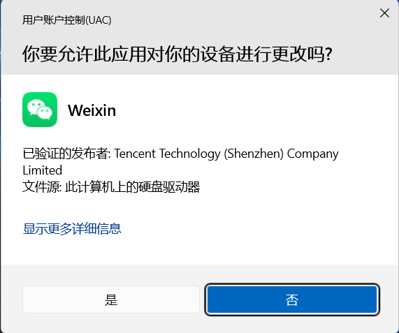
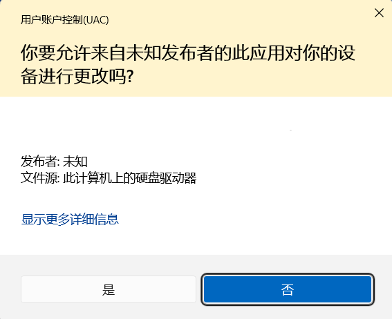
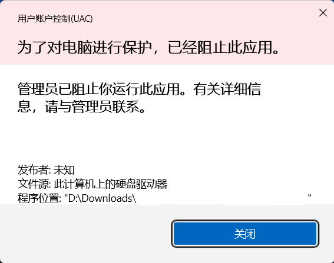
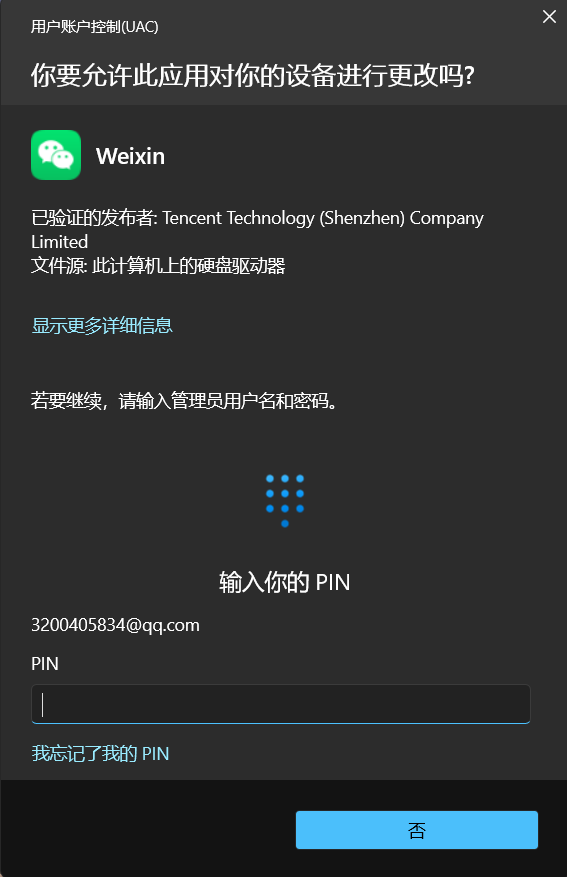
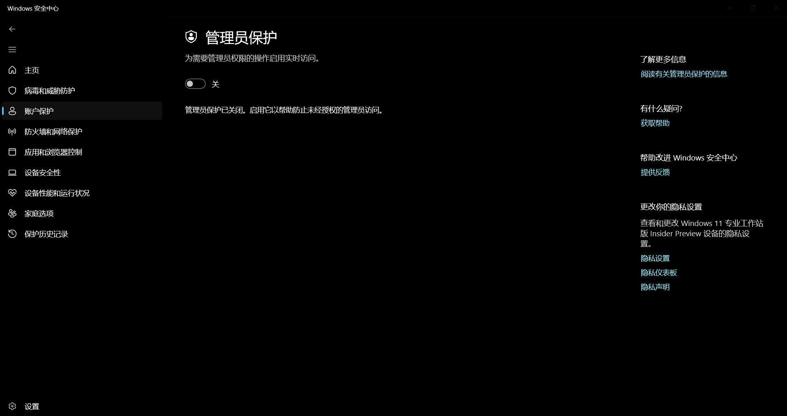

开始这篇文章前，我们先来讲个关于这个话题的电脑段子：

Q：大神大神，我有个问题请教一下。
A：说吧。
Q：你认识 Windows 系统的管理员吗？我看到我的电脑说要我联系它。
A：……

那么，本文旨在介绍 Administrator 账号，管理员权限以及用户账号控制机制（UAC）。

# 什么是管理员权限?

我们依然把电脑比作一套房子。那么众所周知，住房子里的人分两类：房东和租客。这分别对应的就是具有管理员权限的账号和普通账号。

在日常居住的时候，租客自己就可以完成很多事：

- 使用房子内部的设施
- 添加一些自己的小物品，比如自己的书
- 把自己的电脑放进房子里

不过有些时候，某些操作一般不可以由租客自己操作：

- 拆掉墙壁
- 更换家具
- 随意更改房子内部的布局

如果租客想要完成上述的这些操作，一般需要房东的同意才可以继续进行。如果房东认为这个操作不合理或者会影响房子接下来的使用，一般不会同意租客的请求。

同样的，将这套逻辑对比过来，普通账号的用户可以在电脑上：

- 打开 Word、浏览器、看视频
- 在桌面、文档文件夹新建文件
- 修改自己账号的壁纸

但遇到这些操作时，就需要具有管理员权限的账号确认，或者由有管理员权限的账号执行：

- 安装 / 卸载大部分软件
- 修改系统设置（时间、防火墙、用户账户）
- 往 C 盘系统文件夹写入文件
- 运行一些工具、驱动程序

这是为了防止部分小白和恶意用户有意或无意的修改系统的核心设置，导致系统变得混乱、臃肿，甚至出现一些不必要的麻烦。

# 什么是 Administrator 账号？

每台 Windows 系统里都住着一位"房东本人"——**Administrator** 账户。它是系统的**内置管理员账户**：从系统装好的那一刻就已经存在，哪怕你在登录界面、账户设置里从来没见到过它。

既然是"房东本人"，权限自然是拉满的：

- 对系统里的任何文件、任何设置都有完全控制权
- **不受 UAC 约束**——它执行操作时不会弹窗询问，一路绿灯

正因为如此，历代 Windows 默认把这位房东**雪藏**起来：账户处于**禁用**状态，也不会出现在登录界面。只有当系统没有任何一个拥有管理员权限的账号，它才会出山管理整个系统。

> [!question] 那为什么不干脆让大家都用 Administrator？
> 
> 因为"全程最高权限"听起来爽，实际很危险。房东如果时时刻刻都处于"完全授权"状态，一旦有骗子（恶意程序）混进房子，它就能拿着这份权限把家翻个底朝天——而且没有任何一道门拦得住它。

所以正常的使用姿势不是"换成 Administrator 登录"，而是：**用自己的管理员账号，需要动系统的时候再单独提权**。这就是下面要讲的 UAC。

# 什么是 UAC？

UAC 的全称是 **User Account Control（用户账号控制）**。名字有点拗口，我们还是拿房子来讲。

房东当然有权改建房子，但如果他时时刻刻都以"完全房东状态"活动，风险就太大了。于是 Windows 想了个聪明的办法：**把身份拆成两张牌**（技术上叫"拆分令牌"）。

当你用一个属于管理员组的账号登录后，系统实际上会同时给你两张身份牌：

- **普通牌**：日常上网、写文档、看视频，用的都是这张
- **管理员牌**：只有要动"房子结构"的时候，才把它拿出来

平时系统只认你手里的"普通牌"——**哪怕你的账号是管理员**，你打开的程序默认也是按普通权限在跑的。只有当某个操作确实需要动系统（装软件、改系统设置、往系统目录写文件……），系统才会弹出那个窗口问你：

> [!warning]
> "接下来的操作需要管理员权限，确认一下？"

你点了"是"，系统才会把"管理员牌"递过去，让**这一次操作**以管理员权限执行；事情办完，牌子马上收回来，又回到"普通牌"的状态。

这样做的好处很实在：哪怕你日常运行的程序里混进了坏东西，它最多也只能拿到"普通牌"——能在你自己的小房间里捣乱，但碰不了房子的承重墙。

# UAC 弹窗怎么看？

UAC 弹窗其实信息量很大。它想告诉你三件事：**谁**要动结构、**凭什么**（发布者是否可信）、**以什么身份**动。

最需要留意的是**发布者**那一栏，大致有这几种情况：

**① 已验证的发布者**

程序带有正规的**数字签名**，Windows 能够验证发布者的身份，这类相对让人放心。就如同外面正式的装修公司，他们来改房子相对靠谱一点。

以微信 PC 端为例，微信的开发者腾讯拥有一个证书（Tencent Technology (Shenzhen) Company Limited），且 Windows 经过认证，认为这是一个正规证书，风险不大，用户同意后对系统的影响不大。不过最后是否要以管理员权限运行取决用户是否希望这样做。

**② 未知发布者（无签名 / 签名不可信）**

程序没有签名，或者签名没法被验证。这不代表它一定是坏的（有些小工具确实没签名），但**必须多留个心眼**。就如同外面的小规模的装修公司，虽然不一定会把房子弄的乱七八糟，但是留一个心眼是有必要的。

以上图为例，这个程序没有证书， Windows 于是对这个程序起了疑心，用了黄底黑字警告正在审批的用户：“嘿，这个程序有点不对劲，小心点！”

**③ 证书已被吊销**

签名原本存在，但已经被管理员（可能是你或者是其他有管理员权限的用户）吊销了——通常是**管理员认为这个程序有问题**（不一定是这个程序本身有问题）。就比如一家装修公司，无论规模如何，一个房东认为这家装修公司有问题，就把它加入了黑名单。其他人就不能找这家装修公司。

以上图为例，这是一个正规软件的安装包，煮包已经提前吊销这个软件的安装证书，所以 Windows 用红底黑字提醒用户：“啊偶，管理员出于安全考虑不允许你运行这个程序”

另外还有两种常见场景：

- **系统组件自己要求提权**：这种提示长得和 UAC 弹窗完全不一样——通常出现在**系统自身需要进行提权操作**上。系统会通过一个**蓝黄相间**的小盾牌图标提醒用户。这就像物业来到你家来安装或修理水电，所做的事情本身可以完全放心，只需要注意你是否真的要这样做。

> [!info] 提示
> 在这种情况下，系统默认不会弹出 UAC 授权弹窗，因为这种操作的提权都是系统自己提出的。所以这种操作务必要仔细阅读整个页面的内容。

 

  > [!tip] 认准这个盾牌
  > 蓝黄相间的小盾牌是 Windows 通用的「**提权**」标志：按钮上带它，说明点下去这一下会用到管理员权限。
  >
  > 以后再看到任何按钮上带这个小盾牌，都可以多停半秒、想清楚再点。

- **普通用户触发管理员操作**：如果你用的是普通账号，弹窗里会要求你输入某个管理员的账号密码。即使程序本身并没有什么大问题。

 在这时， Windows 会要求普通用户输入管理员的密码来进行提权操作。就如同虽然是个正规装修公司，但你是个租客，拿不了主意，需要房东的同意才能继续。
  
  以微信在普通权限账号下提权运行为例， Windows 虽然经过认证认为这是一个可信开发者，但是由于你没有管理员权限， Windows 就会要求你提供这台电脑管理员的账号和密码，让管理员来把把关。

  

# 遇到 UAC 弹窗怎么办？

三句话就够：

1. **看名字**：弹窗里的程序名你不认识，或者你根本没主动打开过它 → 直接点"否"
2. **看发布者**：写着"未知发布者"，而你又没在装什么新东西 → 点"否"
3. **别嫌烦**：UAC 弹窗不是麻烦，它是房子里最后一道门锁。随手点"是"，等于把"管理员牌"递给了一个陌生人

> [!warning] 务必牢记
> 如果有人教你"把 UAC 关掉就清净了"——请对这个人保持警惕 😉

# 什么是管理员保护？

前面说了，UAC 的思路是"要动结构时弹个窗，确认一下"。那有没有更严格的做法？有——微软在 Windows 11 里加了个新功能：**管理员保护（Administrator Protection）**。

还是回到房子。UAC 相当于"房东签个字就放行"，但签字这件事本身有漏洞——万一有人照着房东的字迹仿签呢？（现实里，就是恶意程序替你点了那个"是"。）

管理员保护把这个流程升级成了两步核身：

1. **先确认"你是房东本人"**：不再只是点一下"是"，而是要求通过 **Windows Hello** 验证——指纹、人脸或 PIN 码。程序可仿不了你的指纹。
2. **干活的不是你的钥匙**：验证通过后，系统会在幕后创建一个**独立的、隐藏的、和你日常账户完全隔开的管理员身份**，把权限交给这次操作，用完立刻销毁。

## 它的几个特点

- **实时提升**：你平时始终处于普通权限状态，只在管理员操作的那一小段时间被临时提升，用完就掉回去
- **配置文件分离**：管理员身份用的是系统生成的隐藏账户，和你自己的用户配置文件**不互通**——所以你账号里的恶意程序即便想搞事，也够不到那个提权会话
- **没有自动提升**：每一次管理员操作都必须由你亲自确认，不存在"上次同意过、这次自动放行"
- **Windows Hello 集成**：验证靠指纹 / 人脸 / PIN，比单纯点"是"可靠得多

**和 UAC 最大的区别**：UAC 挡的是"你没注意就点了是"，管理员保护挡的是"**就算你点了，也得先证明你是你**"。

## 怎么打开它？

它**默认是关闭的**，随 Windows 11 的 KB5120998 更新一起提供（24H2 / 25H2，从家庭版到教育版都支持）。如果你在安全中心里暂时没看到这个开关，不用急——它目前是分批推送的。

最简单的方式：

1. 打开「**Windows 安全中心**」
2. 进入「**帐户保护**」，找到「**管理员保护**」
3. 打开开关
4. **重启电脑**（必须重启才会生效）

在「帐户保护」页里就能找到这个开关，打开后按提示重启即可。

也可以在组策略里开（`secpol.msc` → 本地策略 → 安全选项 → "用户帐户控制：配置管理员审批模式类型" → 选"具有管理员保护的管理员审批模式"）；企业环境还能通过 Intune 统一下发。

## 有什么要注意的？

它比较严格，所以有些场景会受影响：

- **不适用**：需要 Hyper-V 的设备；Windows 365 云电脑和 Azure 虚拟桌面（官方说未来版本才会支持这些环境和 Windows Server）
- **开发环境要重配**：比如 WSL、Visual Studio 这类工具，如果需要在提升状态下跑，得在提升的配置文件里单独重装、重新配置一遍
- **网络驱动器访问不了**：提升后的应用看不到映射的网络驱动器，必要时先把文件复制到本地
- **不共享登录状态**：普通会话的登录状态（SSO）不会带进提升会话，可能需要在提升会话里重新登录
- 遇到问题时，官方建议把"临时关掉管理员保护"作为排查手段

> 一句话总结：UAC 是"门锁"，管理员保护是"门锁 + 刷脸"。在习惯 UAC 弹窗之后，这大概就是 Windows 提权机制的下一个形态。

---

**延伸阅读**：[管理员保护 - Microsoft Learn](https://learn.microsoft.com/zh-cn/windows/security/application-security/application-control/administrator-protection/)
