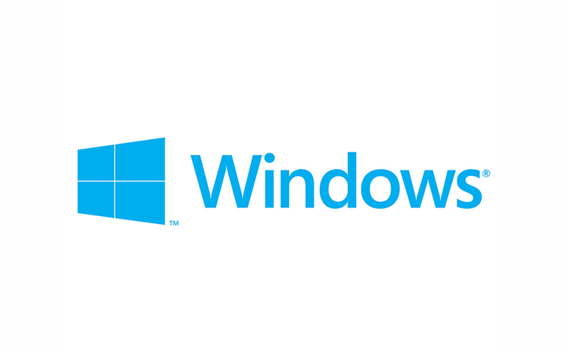
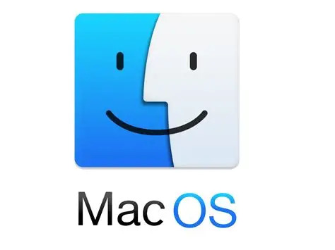
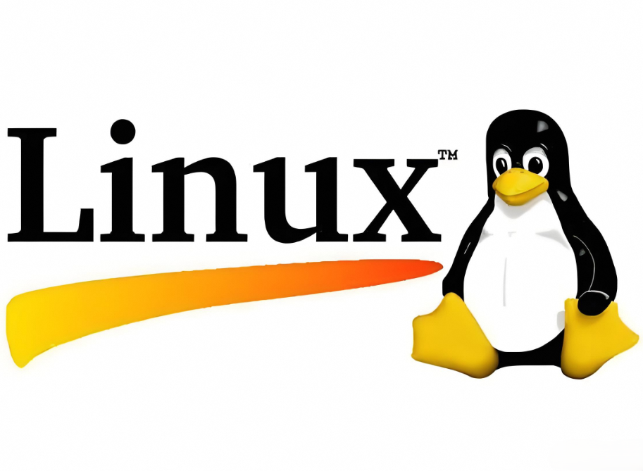
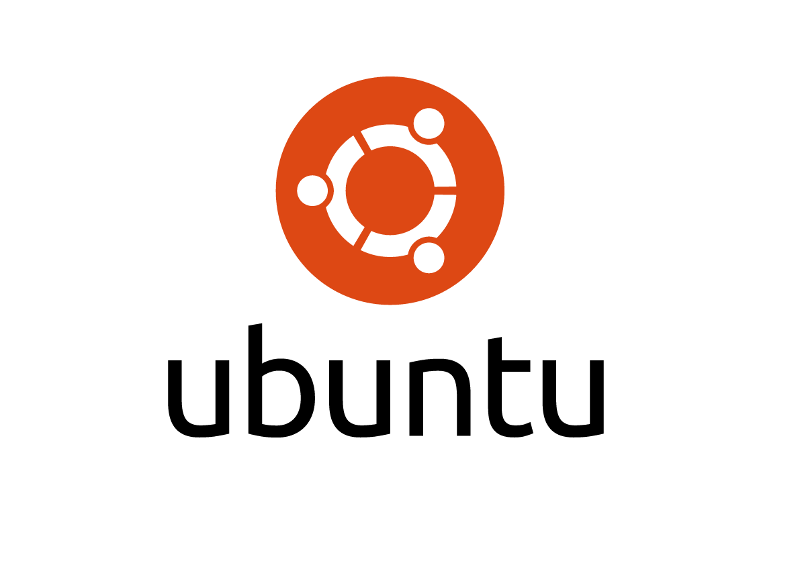
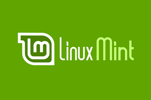
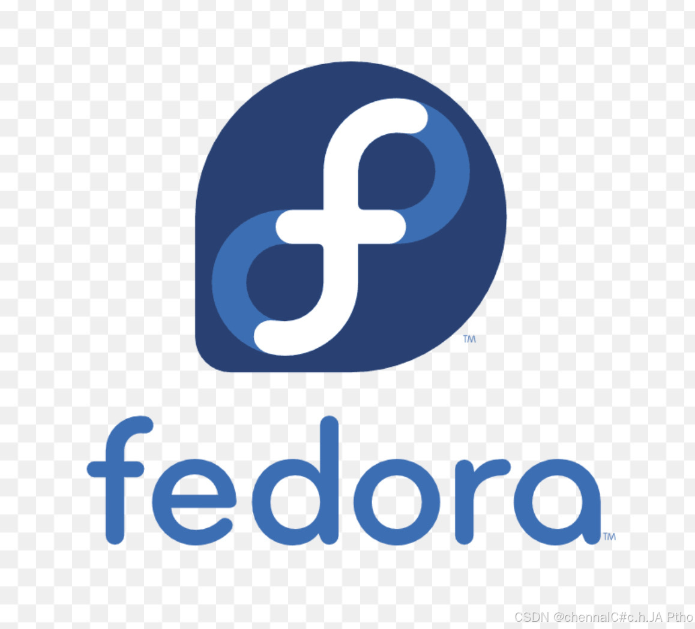
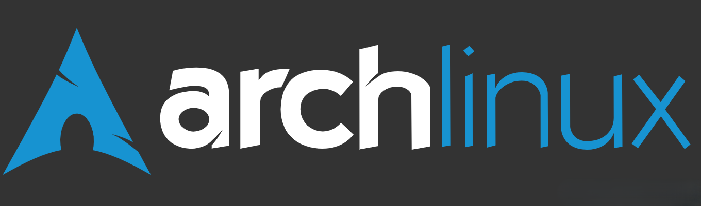

认识完了硬件，接下来我们来认识软件。

当前市面上常见的操作系统主要就三个：Windows、Mac OS和Linux，接下来我们就重点介绍这三个操作系统。

> [!tip] 还不了解操作系统？ 
>请参阅[前述](前述.md)，这里详细的介绍了操作系统的概念。

# Windows（中文称视窗，Microsoft维护开发）

## 概论

Microsoft Windows（视窗操作系统）是微软公司（Microsoft）开发的一系列图形用户界面操作系统，主要应用于个人电脑、服务器及物联网设备。Windows以图形化界面、广泛的软件兼容性与硬件适应性为主要特点。根据市场统计，Windows长期占据全球桌面操作系统市场的主要份额。该系统通过定期功能更新与安全补丁持续演进，并构成了庞大的软硬件生态系统。

Windows系统适合每一个人，这主要归功于低上手门槛的图形界面、过去各大软件开发商的市场策略与中国近十年来的对Windows生态的依赖。

我们后续的所有文章都会根据这个系统来展开。

## 你需要安装哪一个系统

### 系列

目前主流的系列版本主要是Windows 7、Windows 10、Windows 11，Windows XP在部分2000~2005年中的古早电脑中依然存在，不过很明显已经被时代所抛弃了。

下表总结了主流的Windows版本的发布时间，结束支持时间：

> [!question] 结束支持？
> 就像瓶装矿泉水也会有保质期一样，Windows系统也会有“保质期”。微软把它称之为[“Microsoft 生命周期策略”（Microsoft Lifecycle Policy）](https://learn.microsoft.com/zh-cn/lifecycle/)。这是为了防止一个操作系统越维护越有更多的安全漏洞和bug。
> 
> 结束支持以后你电脑的操作系统仍然可以继续使用，但如果后续出现了重大安全漏洞，微软不会第一时间修复它。这意味着你的电脑越容易被黑客攻击。所以，Microsoft和PC专家们十分建议把你的电脑升级到受支持的版本。

| 主流Windows操作系统 | 发布日期        | 是否正式结束支持 | 主流支持结束时间    | 扩展支持结束时间      | lot LTSC（企业长期支持版本）支持结束时间 |
| ------------- | ----------- | -------- | ----------- | ------------- | ------------------------ |
| Windows XP    | 2001年10月25日 | 是        | 2009年4月14日  | 2014年4月8日     | 不存在                      |
| Windows 7     | 2009年10月22日 | 是        | 2015年1月13日  | 2020年1月14日    | 不存在                      |
| Windows 10    | 2015年7月29日  | 否        | 2025年10月14日 | 最晚2028年10月10日 | 2032年1月13日               |
| Windows 11    | 2021年10月4日  | 否        | 不适用         | 不适用           | 不适用                      |

### 版本（SKU）

SKU有些复杂，因为各个Windows的大版本它下面的SKU命名方式一般有很大区别：

| 主流Windows操作系统         | 消费市场级（越往后后功能越多）              | 企业市场级 | 其他小众版本                                                                     |
| --------------------- | ---------------------------- | ----- | -------------------------------------------------------------------------- |
| Windows XP            | 家庭版<专业版                      | 无     | Media Center（媒体中心版，影音娱乐用）、Tablet PC（平板版，平板用）                               |
| Windows 7             | 入门版<家庭普通版<家庭高级版<专业版<旗舰版      | 企业版   | N/KN/E 版（合规阉割版）、Signature Edition（签名纪念版）、Embedded （POS机用）、Surface（电子茶几开发版） |
| Windows 10、Windows 11 | 家庭版<专业版<教育版<专业教育版<企业版<专业工作站版 | 企业版   | Windows S（S 模式，小孩用）、LTSB/LTSC（长期服务企业版）、单语言版、IoT 系列（物联网设备用）                 |

> [!tip] 怎么选SKU
> 一般小白选家庭版就好（品牌机预装、购买便宜）。专业版主要聚焦于企业管理和业务，其他就和家庭版没有两样。选择专业版并不会在体验上带来很大的区别。

# macOS（Apple开发维护）

macOS是由苹果（Apple）公司开发的桌面操作系统，只能运行在苹果自家的Mac系列电脑上。苹果每一年都会为所有支持的苹果电脑推送最新系统版本的更新。目前最新的版本是macOS Tahoe（2025~2026）

> [!warning] 想入手苹果电脑？三思而后行
> 是的，虽然我们承认苹果电脑带出去喝星巴克很拉风。但由于以下原因，我们还是建议你再考虑一下：
> - **macOS和Windows的操作逻辑完全不同，你需要重新学习一套操作逻辑**（如文件管理：Windows文件资源管理器对应苹果访达；关闭按钮：Windows右上角对应苹果左上角；快捷键：Windows是Ctrl对应苹果Command）
> - **Steam游戏玩家直接劝退，因为Steam上的大部分游戏都只兼容Windows**
> - **你的工作软件可能只在Windows端独占，你可能要搭建虚拟机**
>
>如果你不存在上述问题，我们再考虑你选购苹果电脑。

## 选购苹果电脑

苹果电脑分两种芯片：2020年推出的M系列芯片（M1至M5，2026年5月30日更新）和老英特尔芯片（现已被苹果逐渐淘汰）。

### M系列芯片

自2020年苹果推出M系列芯片，其功耗低、性能强悍的特点（~~以及Windows逐渐的反人性化原因~~）吸引力无数轻办公PC用户入坑Mac。接下来，煮包将介绍M系列Mac电脑的选购。

目前M系列芯片主要有5代：由M1到M5。这很好理解：数字越大，性能越强。然后就是后缀了，一般来讲，M系列芯片有以下几个后缀，其性能由弱到强的排列顺序是：

- Pro：定义为专业版，其性能比无后缀的强
- Max：定义为旗舰版
- **Ultra**：定义为顶级工作站版

### 英特尔芯片

不推荐，因为苹果已经在最新的macOS系统中逐渐放弃了对英特尔芯片的兼容。

# Linux(由开源社区开发维护)

## Linux的传奇故事

说到这个系统，就不得不来讲讲操作系统发展史了：20世纪80年代，计算机硬件的性能不断提高，PC的市场不断扩大，当时可供计算机选用的操作系统主要有Unix、DOS和MacOS这几种。不过，这几个系统要么兼容性差（Unix不适合在PC上运行，MacOS上文介绍过），要么就是被软件厂商设置了严格的保密协议（指的就是当时的各种DOS系统：如86-DOS、MS-DOS、PC-DOS等）。

在这一背景下，AndrewS.Tanenbaum教授为了给学生们演示内部工作原理，就编写了一个叫MINIX的操作系统，并将其开源出去供学生们研究学习。

> [!question] 什么是开源？
> 程序员们有一句话：“不要重复造轮子”，意思是如果有一个优质的解决方案，就不要再尝试从头开始来写一个新的方案。开源就意味着你把你自己的优质的解决方案分享出去供其他人参考使用。
> 
> 开源并不完全等于免费。对被分享者来说，优质的开源项目有利于学习别人的思维逻辑，提升自己的知识，所以开源并不是简单等于免费。
> 
> 话说，您正在看的这篇文章，本身也是一个开源项目

在这位教授开源项目的影响下，当时一位大二男大——[Linus Torvalds](https://github.com/torvalds)就根据MINIX操作系统编写了一个操作系统，这就是这里介绍的大名鼎鼎的Linux。

Linux看似离我们很遥远，但其实它就在我们的身边：谷歌开发的Android（安卓）的最底层就是Linux内核；我们访问的大部分网站，其服务器系统也是Linux；联机游戏处理你与其他玩家操作的服务器还是Linux。所以，Linux无处不在。

同时，由于其低资源占用和国外优秀的生态（国内已逐步跟进），Linux也是不少极客用户的心头好。

## Linux发行版

> [!info] 什么是Linux发行版？
> Linux本身只是一个"内核"（系统的核心），就像汽车的发动机一样，光有发动机是开不了车的。而**Linux发行版** = Linux内核 + 各种软件 + 包管理器 + 桌面环境，相当于给发动机装上了车身、轮胎、方向盘，让你真正能"开"起来。不同的发行版就像是不同品牌的车。选择哪个，取决于你的需求。
> 如果你想深入了解Linux的发行版，可以访问[Linux.org](https://www.linux.org/pages/download/)了解更多，这里介绍几个常见的发行版。

### 面向新手的发行版

#### Ubuntu（乌班图）——入门首选

Ubuntu是目前**最流行**的Linux发行版，由Canonical公司维护。它拥有庞大的中文社区、丰富的教程资源和友好的安装体验。

Ubuntu具有以下几个特点：

- 社区庞大，遇到问题基本都能搜到答案 
- 软件源丰富，安装软件方便 
- 每6个月发布新版本，2年发布一个LTS长期支持版 ，更新勤

#### Linux Mint——更适合Windows用户

基于Ubuntu，桌面界面像Windows，Windows用户迁移过来几乎不需要适应。适合刚刚从Windows转向Linux的“Windows难民”使用。

### 面向进阶用户的发行版

#### Debian——Linux界最严厉的父亲

Linux最严厉的父亲之一，是上文Ubuntu的上游，以极致稳定著称（据说有很多台Debian服务器十年都没有关机），服务器首选。

#### Fedora——技术前沿

红帽赞助，永远使用最新的内核和软件。

### 硬核玩家的最终选择

#### Arch Linux——一切自己动手

滚动更新、永远不需要重装，但安装过程十分硬核，新手小白直接劝退。

### 我该考虑Linux吗？

如果你的需求主要是轻量化办公、Linux开发，甚至你想让你家的老电脑焕发第二春，Linux或许可以帮助你实现你的想法。

# 国产系统

近年来，随着国际形势的变化和国内科技产业的发展，国产操作系统逐渐走进了大众视野。它们不仅在党政军领域得到广泛应用，也开始面向普通消费者开放。

## 华为鸿蒙操作系统（HarmonyOS）

华为鸿蒙是华为公司自主研发的分布式操作系统，于2019年首次发布。它的设计理念是"一生万物，万物归一"——一套系统能运行在手机、平板、电脑、手表、电视、车机等所有设备上。

你可能会有疑问：鸿蒙不是一个手机操作系统吗？的确是，但自2025年年中华为正式发布两款的鸿蒙PC后，鸿蒙就成为了一个可以横跨手机、平板、电脑、电视、手表等多设备的操作系统。

### 关于鸿蒙

鸿蒙并不是Linux发行版，而是一个**完全独立的操作系统**。在早期版本（HarmonyOS 4及之前）中，鸿蒙兼容Linux内核的驱动和应用架构，但自HarmonyOS 5（鸿蒙星河版）起，底层已完全替换为华为自研的微内核架构（鸿蒙微内核 + 方舟编译器）。

很多人以为鸿蒙是"套壳Android"，但实际上自鸿蒙5（Harmony OS NEXT，代号鸿蒙星河版）以来，鸿蒙的底层架构就完全抛弃了AOSP(Android Open Source Project，是所有安卓手机系统的源头框架)。鸿蒙采用了**分布式软总线**技术，可以让手机、平板、电脑之间的任务无缝流转。

> [!example] 鸿蒙未来的挑战
> Harmony OS 5.0彻底去掉了Android兼容层，这意味着现有的Android应用不能在纯血鸿蒙上直接运行。如果有运行安卓应用的需要（如小众软件还没有适配），需要使用容器管理应用**卓易通**和**出境易**运行。
> 
> 如果你不希望使用这些应用的话，我们建议再等等鸿蒙的发展。

## 统信UOS（统一操作系统）和麒麟操作系统（KylinOS）

统信UOS是基于Deepin发展而来的国产Linux发行版，由统信软件公司维护。

麒麟操作系统由国防科技大学和麒麟软件有限公司联合开发，是国内党政军领域使用最广泛的操作系统之一。

这两大系统的底层都是基于Linux系统修改的，由于其模仿Windows的图形界面而带来的低上手门槛、国内软件生态的适配、以及政府单位的“操作系统自主可控”的战略，他们的市占率在逐步上升。

## 小结

虽然国产操作系统正处于快速发展的阶段。不过也得要客观地说，国产操作系统在软件生态方面还有很大的追赶空间。如果你离不开Windows独占的软件，建议先通过虚拟机体验。

# 结语

通过本文，你应该简单了解了目前市面上常见的操作系统。下一步，我们将会介绍新电脑到手后的验机指南。